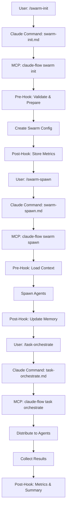
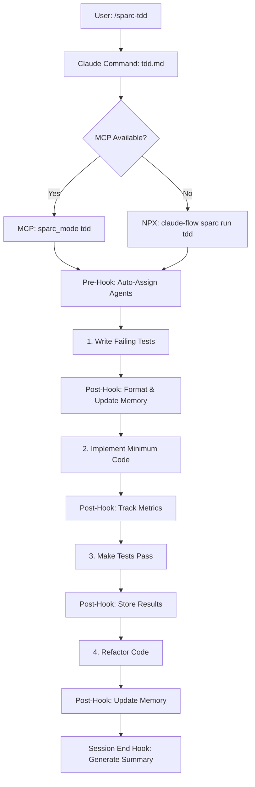
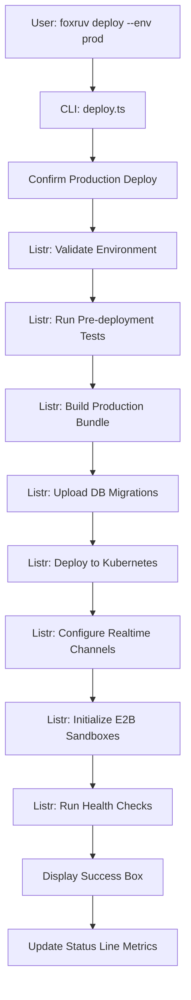

# FoxRev MCP & CLI Architecture Analysis

**Date:** 2025-11-17
**Analyzed Project:** FoxRev Multi-Agent AI Orchestration Platform
**Purpose:** Extract reusable patterns for IRIS Prime Console integration

---

## Executive Summary

This document analyzes FoxRev's sophisticated MCP server integration and CLI architecture to identify reusable patterns for IRIS Prime Console. FoxRev demonstrates a **three-tier orchestration model**: MCP servers for coordination, Claude commands for automation, and a professional CLI for deployment/management.

### Key Findings

1. **97 Claude Commands** organized into 15 categories with consistent structure
2. **3 MCP Servers** (claude-flow, ruv-swarm, neo4j) with comprehensive hooks integration
3. **Standalone CLI Package** (`@foxruv/cli`) with 7 major command groups
4. **Custom Status Line** showing real-time swarm/metrics visualization
5. **Script Integration** layer wrapping MCP tools with proxy/gateway support

---

## 1. CLI Package Architecture

### 1.1 Package Structure

```
cli/
├── bin/
│   └── foxruv.js              # Binary entry point
├── src/
│   ├── index.ts               # CLI initialization & command registration
│   ├── commands/              # Command implementations
│   │   ├── init.ts            # Project initialization
│   │   ├── deploy.ts          # Deployment orchestration
│   │   ├── manage.ts          # Resource management (swarms/agents/tasks)
│   │   ├── benchmark.ts       # Performance benchmarking
│   │   ├── status.ts          # Health & status monitoring
│   │   ├── logs.ts            # Log viewing
│   │   └── config.ts          # Configuration management
│   └── types/                 # TypeScript definitions
├── package.json               # Dual bin entries (foxruv/fr)
└── README.md                  # Comprehensive documentation
```

### 1.2 Technology Stack

```json
{
  "framework": "commander",
  "ui_components": {
    "branding": "figlet + gradient-string",
    "progress": "ora + listr2",
    "tables": "cli-table3",
    "prompts": "inquirer",
    "formatting": "chalk + boxen"
  },
  "execution": "execa",
  "config": "yaml + dotenv",
  "validation": "zod"
}
```

### 1.3 Key Design Patterns

#### Binary Entry Pattern
```javascript
// bin/foxruv.js
#!/usr/bin/env node
require('../dist/index.js');
```

#### Command Registration Pattern
```typescript
// src/index.ts
import { Command } from 'commander';
const program = new Command();

program
  .name('foxruv')
  .description('FoxRuv Platform CLI')
  .version('1.0.0')
  .addCommand(initCommand)
  .addCommand(deployCommand)
  .addCommand(manageCommand)
  // ... more commands

program.parse(process.argv);
```

#### Subcommand Pattern
```typescript
// src/commands/manage.ts
const manageSwarms = new Command('swarms')
  .description('Manage agent swarms')
  .option('-l, --list', 'List all swarms')
  .option('-c, --create', 'Create new swarm')
  .action(async (options) => { /* implementation */ });

const manageAgents = new Command('agents')
  .description('Manage individual agents')
  .option('-l, --list', 'List agents')
  .action(async (options) => { /* implementation */ });

export const manageCommand = new Command('manage')
  .description('Manage FoxRuv platform resources')
  .addCommand(manageSwarms)
  .addCommand(manageAgents)
  .addCommand(manageTasks);
```

#### Task Orchestration Pattern
```typescript
// Using Listr2 for multi-step operations
const tasks = new Listr([
  {
    title: 'Validating environment configuration',
    task: async () => { /* validation */ }
  },
  {
    title: 'Running pre-deployment checks',
    skip: () => options.skipTests,
    task: async () => await execa('npm', ['run', 'test'])
  },
  {
    title: 'Building production bundle',
    skip: () => options.skipBuild,
    task: async () => await execa('npm', ['run', 'build'])
  },
  // ... more tasks
]);

await tasks.run();
```

#### Rich Output Pattern
```typescript
// Benchmark results with tables and boxes
const resultsTable = new Table({
  head: ['Component', 'Metric', 'Target', 'Achieved', 'Status'],
  style: { head: ['cyan'] }
});

resultsTable.push(
  ['AgentDB', 'Vector Search', '<50ms', '45ms', chalk.green('✓ PASS')],
  ['Agentic-Flow', 'Code Transform', '352x', '352x', chalk.green('✓ PASS')]
);

const summaryBox = boxen(
  chalk.white.bold('Performance Summary\n\n') +
  chalk.green('✓ All benchmarks passed\n') +
  chalk.gray('Total Tests: ') + chalk.cyan('9\n'),
  {
    padding: 1,
    margin: 1,
    borderStyle: 'double',
    borderColor: 'green'
  }
);
```

---

## 2. Claude Commands Organization

### 2.1 Command Categories (97 Total)

```
.claude/commands/
├── agents/           (5)  - Agent lifecycle management
├── analysis/         (5)  - Code & performance analysis
├── automation/       (7)  - Auto-spawning, self-healing, smart agents
├── github/           (6)  - PR management, code review, release coordination
├── hive-mind/        (12) - Collective intelligence, consensus, memory sharing
├── hooks/            (7)  - Pre/post operation hooks, session management
├── mcp/              (5)  - MCP server management & testing
├── monitoring/       (6)  - Status, metrics, health checks
├── optimization/     (6)  - Performance tuning, bottleneck analysis
├── sparc/            (16) - SPARC methodology modes (TDD, architect, etc.)
├── swarm/            (10) - Swarm initialization, spawning, monitoring
├── training/         (6)  - Neural pattern training, learning
└── workflows/        (6)  - Workflow creation, execution, templates
```

### 2.2 Command File Structure

**Standard Pattern:**
```markdown
# command-name

Brief description of the command.

## Usage
```bash
npx claude-flow category command-name [options]
```

## Options
- `--option1 <value>` - Description
- `--option2` - Description

## Examples
```bash
# Example 1
npx claude-flow category command-name --option1 value

# Example 2
npx claude-flow category command-name --option2
```
```

**Enhanced Pattern (SPARC commands):**
```markdown
# SPARC Mode Name

## Purpose
High-level purpose and use case.

## Activation

### Option 1: Using MCP Tools (Preferred in Claude Code)
```javascript
mcp__claude-flow__sparc_mode {
  mode: "tdd",
  task_description: "shopping cart feature",
  options: {
    coverage_target: 90,
    test_framework: "jest"
  }
}
```

### Option 2: Using NPX CLI (Fallback when MCP not available)
```bash
npx claude-flow sparc run tdd "shopping cart feature"
```

### Option 3: Local Installation
```bash
./claude-flow sparc run tdd "shopping cart feature"
```

## Core Capabilities
- Capability 1
- Capability 2

## Workflow
1. Step 1
2. Step 2

## Patterns/Strategies
- Pattern 1
- Pattern 2
```

### 2.3 Category Deep-Dive: SPARC Commands

**16 SPARC methodology commands** provide comprehensive development workflows:

```
sparc/
├── analyzer.md          - Code analysis with pattern detection
├── architect.md         - System design with memory coordination
├── batch-executor.md    - Parallel SPARC mode execution
├── coder.md            - Implementation with test generation
├── debugger.md         - Systematic debugging workflow
├── designer.md         - UI/UX design with component specs
├── documenter.md       - Comprehensive documentation generation
├── innovator.md        - Creative solution exploration
├── memory-manager.md   - Cross-agent memory coordination
├── optimizer.md        - Performance optimization strategies
├── researcher.md       - Research with citation management
├── reviewer.md         - Code review with quality gates
├── swarm-coordinator.md - Multi-agent swarm orchestration
├── tdd.md             - Test-driven development workflow
├── tester.md          - Comprehensive test suite creation
└── workflow-manager.md - Workflow automation & templates
```

**Key Pattern: Multi-activation strategy**
- MCP tool invocation (preferred in Claude Code)
- NPX CLI fallback (terminal/non-MCP environments)
- Local installation option (development)

---

## 3. MCP Server Configuration

### 3.1 MCP Servers Enabled

From `.claude/settings.json`:
```json
{
  "enabledMcpjsonServers": ["claude-flow", "ruv-swarm", "neo4j"]
}
```

### 3.2 Hooks Integration

**Pre-Tool-Use Hooks:**

```json
{
  "PreToolUse": [
    {
      "matcher": "Bash",
      "hooks": [{
        "type": "command",
        "command": "cat | jq -r '.tool_input.command // empty' | tr '\\n' '\\0' | xargs -0 -I {} npx claude-flow@alpha hooks pre-command --command '{}' --validate-safety true --prepare-resources true"
      }]
    },
    {
      "matcher": "Write|Edit|MultiEdit",
      "hooks": [{
        "type": "command",
        "command": "cat | jq -r '.tool_input.file_path // .tool_input.path // empty' | tr '\\n' '\\0' | xargs -0 -I {} npx claude-flow@alpha hooks pre-edit --file '{}' --auto-assign-agents true --load-context true"
      }]
    }
  ]
}
```

**Post-Tool-Use Hooks:**

```json
{
  "PostToolUse": [
    {
      "matcher": "Bash",
      "hooks": [{
        "type": "command",
        "command": "cat | jq -r '.tool_input.command // empty' | tr '\\n' '\\0' | xargs -0 -I {} npx claude-flow@alpha hooks post-command --command '{}' --track-metrics true --store-results true"
      }]
    },
    {
      "matcher": "Write|Edit|MultiEdit",
      "hooks": [{
        "type": "command",
        "command": "cat | jq -r '.tool_input.file_path // .tool_input.path // empty' | tr '\\n' '\\0' | xargs -0 -I {} npx claude-flow@alpha hooks post-edit --file '{}' --format true --update-memory true"
      }]
    }
  ]
}
```

**Pre-Compact Hooks:**

```json
{
  "PreCompact": [
    {
      "matcher": "manual",
      "hooks": [{
        "type": "command",
        "command": "/bin/bash -c 'echo \"🔄 PreCompact Guidance:\"; echo \"📋 IMPORTANT: Review CLAUDE.md for 54 agents, swarm strategies, SPARC workflows\"'"
      }]
    }
  ]
}
```

**Session-End Hook:**

```json
{
  "Stop": [
    {
      "hooks": [{
        "type": "command",
        "command": "npx claude-flow@alpha hooks session-end --generate-summary true --persist-state true --export-metrics true"
      }]
    }
  ]
}
```

### 3.3 Environment Configuration

```json
{
  "env": {
    "CLAUDE_FLOW_AUTO_COMMIT": "true",
    "CLAUDE_FLOW_AUTO_PUSH": "false",
    "CLAUDE_FLOW_HOOKS_ENABLED": "true",
    "CLAUDE_FLOW_TELEMETRY_ENABLED": "true",
    "CLAUDE_FLOW_REMOTE_EXECUTION": "true",
    "CLAUDE_FLOW_CHECKPOINTS_ENABLED": "true"
  }
}
```

### 3.4 Permissions Model

```json
{
  "permissions": {
    "allow": [
      "Bash(npx claude-flow:*)",
      "Bash(npm run lint)",
      "Bash(npm run test:*)",
      "Bash(git status)",
      "Bash(git diff:*)",
      // ... more git operations
      "Bash(jq:*)",
      "Bash(node:*)"
    ],
    "deny": [
      "Bash(rm -rf /)"
    ]
  }
}
```

---

## 4. Custom Status Line

### 4.1 Status Line Features

Located at `.claude/statusline-command.sh`, provides real-time visualization:

```bash
#!/bin/bash
INPUT=$(cat)
MODEL=$(echo "$INPUT" | jq -r '.model.display_name // "Claude"')
CWD=$(echo "$INPUT" | jq -r '.workspace.current_dir // .cwd')
DIR=$(basename "$CWD")
BRANCH=$(cd "$CWD" && git branch --show-current)

printf "\033[1m$MODEL\033[0m in \033[36m$DIR\033[0m"
[ -n "$BRANCH" ] && printf " on \033[33m⎇ $BRANCH\033[0m"
```

### 4.2 Swarm Metrics Display

**Topology & Agent Count:**
```bash
if [ -f "$FLOW_DIR/swarm-config.json" ]; then
  STRATEGY=$(jq -r '.defaultStrategy' "$FLOW_DIR/swarm-config.json")
  case "$STRATEGY" in
    "balanced") TOPO_ICON="⚡mesh" ;;
    "conservative") TOPO_ICON="⚡hier" ;;
    "aggressive") TOPO_ICON="⚡ring" ;;
  esac
  printf " \033[35m$TOPO_ICON\033[0m"

  AGENT_COUNT=$(jq -r '.agentProfiles | length' "$FLOW_DIR/swarm-config.json")
  printf " \033[35m🤖 $AGENT_COUNT\033[0m"
fi
```

**System Metrics (Color-Coded):**
```bash
# Memory usage (green <60%, yellow 60-80%, red >80%)
MEM_PERCENT=$(jq -r '.[-1].memoryUsagePercent' "$FLOW_DIR/metrics/system-metrics.json")
if [ "$MEM_PERCENT" -lt 60 ]; then
  MEM_COLOR="\033[32m"  # Green
elif [ "$MEM_PERCENT" -lt 80 ]; then
  MEM_COLOR="\033[33m"  # Yellow
else
  MEM_COLOR="\033[31m"  # Red
fi
printf " ${MEM_COLOR}💾 ${MEM_PERCENT}%\033[0m"

# CPU load (similar color coding)
CPU_LOAD=$(jq -r '.[-1].cpuLoad * 100' "$FLOW_DIR/metrics/system-metrics.json")
printf " ${CPU_COLOR}⚙ ${CPU_LOAD}%\033[0m"
```

**Task Performance Metrics:**
```bash
# Calculate success rate, average duration, streak
METRICS=$(jq -r '
  (map(select(.success == true)) | length) as $successful |
  (length) as $total |
  (if $total > 0 then ($successful / $total * 100) else 0 end) as $success_rate |
  (map(.duration) | add / length) as $avg_duration |
  (reverse | reduce .[] as $task (0; if $task.success then . + 1 else 0 end)) as $streak |
  { success_rate, avg_duration, streak, total } | @json
' "$FLOW_DIR/metrics/task-metrics.json")

SUCCESS_RATE=$(echo "$METRICS" | jq -r '.success_rate')
printf " ${SUCCESS_COLOR}🎯 ${SUCCESS_RATE}%\033[0m"

AVG_TIME=$(echo "$METRICS" | jq -r '.avg_duration')
printf " \033[36m⏱️ ${TIME_STR}\033[0m"

STREAK=$(echo "$METRICS" | jq -r '.streak')
printf " \033[91m🔥 $STREAK\033[0m"
```

**Example Output:**
```
Claude in 🌊 Claude Flow on ⎇ main │ ⚡mesh 🤖 8 💾 42% ⚙ 28% 🎯 95% ⏱️ 2.3s 🔥 12 📋 3 🔗
```

---

## 5. Scripts Integration with MCP

### 5.1 MCP Wrapper Pattern

**Purpose:** Route MCP traffic through proxy/gateway for remote access

**Example: Neo4j MCP Wrapper**
```bash
#!/bin/bash
# scripts/mcp-neo4j-wrapper.sh
export NEO4J_URI="${NEO4J_URI:-bolt://100.69.78.17:7687}"
export NEO4J_USERNAME="${NEO4J_USERNAME:-neo4j}"
export NEO4J_PASSWORD="${NEO4J_PASSWORD:-secret}"

# Force SOCKS proxy for remote Neo4j
export ALL_PROXY="socks5://127.0.0.1:1055"
export HTTP_PROXY="socks5://127.0.0.1:1055"
export HTTPS_PROXY="socks5://127.0.0.1:1055"

# Run MCP server through proxy
exec proxychains4 -q uvx mcp-neo4j-cypher@0.3.0 "$@"
```

### 5.2 Direct MCP Integration

**AgentDB Initialization Script:**
```typescript
// scripts/agentdb/01-initialize.ts
import { AgentDB } from '@upstash/agentdb';
import { Index } from '@upstash/vector';

const AGENTDB_PATH = '.agentdb/microbiome.db';
const BATCH_SIZE = 100;

const VECTOR_CONFIGS = {
  discovery: {
    url: process.env.UPSTASH_VECTOR_URL_DISCOVERY!,
    token: process.env.UPSTASH_VECTOR_TOKEN_DISCOVERY!,
    dimension: 3072,
    namespace: 'discovery',
    description: 'High-precision functional pathway research'
  },
  // ... more namespaces
};

// Initialize AgentDB with namespaces
async function initializeAgentDB() {
  const agentdb = new AgentDB({ path: AGENTDB_PATH });

  for (const [name, config] of Object.entries(VECTOR_CONFIGS)) {
    console.log(`Creating namespace: ${name}`);
    await agentdb.createNamespace(name, {
      dimension: config.dimension,
      description: config.description
    });
  }
}
```

### 5.3 Self-Contained Query Script

**Neo4j Query Script:**
```python
#!/usr/bin/env python3
"""
Self-contained Neo4j query script.
Zero dependencies between scripts.
"""
import argparse
from neo4j import GraphDatabase

class Neo4jQuery:
    def __init__(self, uri, username, password, database="neo4j"):
        self.driver = GraphDatabase.driver(uri, auth=(username, password))
        self.database = database

    def query(self, cypher, params=None):
        with self.driver.session(database=self.database) as session:
            result = session.run(cypher, params or {})
            return [record.data() for record in result]

def main():
    parser = argparse.ArgumentParser()
    parser.add_argument('--uri', default=os.getenv('NEO4J_URI'))
    parser.add_argument('--cypher', required=True)
    args = parser.parse_args()

    neo = Neo4jQuery(args.uri, args.username, args.password)
    result = neo.query(args.cypher)
    print(json.dumps(result, indent=2))
```

---

## 6. Command Flow Examples

### 6.1 Flow: Swarm Initialization → Agent Spawning → Task Orchestration



### 6.2 Flow: SPARC TDD Workflow



### 6.3 Flow: CLI Deployment



---

## 7. Reusable Patterns for IRIS Prime

### 7.1 Three-Tier Orchestration Model

```
┌─────────────────────────────────────────────────────────────┐
│                    TIER 1: CLI LAYER                        │
│  Professional CLI for deployment, management, monitoring     │
│  - @iris-prime/cli package                                  │
│  - Commander framework                                       │
│  - Rich UI (ora, listr2, chalk, boxen)                     │
│  - Commands: init, deploy, manage, benchmark, status        │
└─────────────────────────────────────────────────────────────┘
                            ↓
┌─────────────────────────────────────────────────────────────┐
│                TIER 2: CLAUDE COMMANDS LAYER                │
│  97 markdown commands organized into categories             │
│  - .claude/commands/{category}/{command}.md                 │
│  - Consistent structure: Usage, Options, Examples           │
│  - Multi-activation: MCP tools, NPX CLI, local install     │
│  - Categories: agents, automation, monitoring, workflows    │
└─────────────────────────────────────────────────────────────┘
                            ↓
┌─────────────────────────────────────────────────────────────┐
│                  TIER 3: MCP SERVER LAYER                   │
│  Integration with MCP servers for coordination              │
│  - claude-flow: SPARC, swarm, hooks, memory                │
│  - ruv-swarm: Advanced swarm coordination                   │
│  - Custom MCP: AgentDB, Neo4j (via wrappers)               │
│  - Hooks: Pre/Post tool use, session management            │
└─────────────────────────────────────────────────────────────┘
```

### 7.2 Command Organization Pattern

**Apply to IRIS Prime:**

```
.claude/commands/
├── iris/             - IRIS-specific orchestration
│   ├── iris-init.md
│   ├── iris-analyze.md
│   ├── iris-report.md
│   └── iris-notify.md
├── consensus/        - Consensus & lineage tracking
│   ├── consensus-track.md
│   ├── lineage-verify.md
│   └── signature-validate.md
├── reflexion/        - Reflexion monitoring
│   ├── reflexion-start.md
│   ├── reflexion-metrics.md
│   └── reflexion-report.md
├── patterns/         - Pattern discovery
│   ├── pattern-discover.md
│   ├── pattern-analyze.md
│   └── pattern-export.md
├── telemetry/        - Global metrics
│   ├── telemetry-track.md
│   ├── telemetry-dashboard.md
│   └── telemetry-export.md
├── notifications/    - WhatsApp & alerting
│   ├── notify-send.md
│   ├── notify-config.md
│   └── notify-test.md
└── supabase/         - Supabase operations
    ├── supabase-sync.md
    ├── supabase-query.md
    └── supabase-migrate.md
```

### 7.3 CLI Command Structure for IRIS Prime

```typescript
// cli/src/index.ts
import { Command } from 'commander';
import { initCommand } from './commands/init';
import { analyzeCommand } from './commands/analyze';
import { monitorCommand } from './commands/monitor';
import { notifyCommand } from './commands/notify';
import { dashboardCommand } from './commands/dashboard';

const program = new Command();

console.log(gradient.pastel(figlet.textSync('IRIS Prime')));
console.log(chalk.cyan('  Intelligent Reflexion Intelligence System'));

program
  .name('iris-prime')
  .description('IRIS Prime Centralized Intelligence Backend')
  .version('1.0.0')
  .addCommand(initCommand)
  .addCommand(analyzeCommand)
  .addCommand(monitorCommand)
  .addCommand(notifyCommand)
  .addCommand(dashboardCommand);

program.parse(process.argv);
```

### 7.4 Hooks Integration Pattern for IRIS Prime

```json
{
  "hooks": {
    "PreToolUse": [
      {
        "matcher": "Write|Edit",
        "hooks": [{
          "type": "command",
          "command": "cat | jq -r '.tool_input.file_path // empty' | xargs -I {} npx iris-prime hooks pre-edit --file '{}' --track-consensus true --store-signature true"
        }]
      }
    ],
    "PostToolUse": [
      {
        "matcher": "Write|Edit",
        "hooks": [{
          "type": "command",
          "command": "cat | jq -r '.tool_input.file_path // empty' | xargs -I {} npx iris-prime hooks post-edit --file '{}' --discover-patterns true --update-metrics true --send-notification true"
        }]
      }
    ],
    "Stop": [
      {
        "hooks": [{
          "type": "command",
          "command": "npx iris-prime hooks session-end --generate-report true --sync-supabase true --notify-completion true"
        }]
      }
    ]
  }
}
```

### 7.5 Status Line Pattern for IRIS Prime

```bash
#!/bin/bash
# .claude/statusline-command.sh

INPUT=$(cat)
MODEL=$(echo "$INPUT" | jq -r '.model.display_name')
CWD=$(echo "$INPUT" | jq -r '.workspace.current_dir')
DIR=$(basename "$CWD")
BRANCH=$(cd "$CWD" && git branch --show-current)

printf "\033[1m$MODEL\033[0m in \033[36m$DIR\033[0m"
[ -n "$BRANCH" ] && printf " on \033[33m⎇ $BRANCH\033[0m"

IRIS_DIR="$CWD/.iris-prime"

if [ -d "$IRIS_DIR" ]; then
  printf " │"

  # Consensus tracking
  if [ -f "$IRIS_DIR/consensus-state.json" ]; then
    CONSENSUS_RATE=$(jq -r '.consensusRate' "$IRIS_DIR/consensus-state.json")
    CONSENSUS_COLOR=$([ "$CONSENSUS_RATE" -gt 90 ] && echo "\033[32m" || echo "\033[33m")
    printf " ${CONSENSUS_COLOR}🤝 ${CONSENSUS_RATE}%\033[0m"
  fi

  # Pattern discovery
  if [ -f "$IRIS_DIR/patterns-discovered.json" ]; then
    PATTERN_COUNT=$(jq -r 'length' "$IRIS_DIR/patterns-discovered.json")
    printf " \033[35m🔍 ${PATTERN_COUNT}\033[0m"
  fi

  # Reflexion monitoring
  if [ -f "$IRIS_DIR/reflexion-metrics.json" ]; then
    REFLEXION_SCORE=$(jq -r '.[-1].truthScore' "$IRIS_DIR/reflexion-metrics.json")
    SCORE_COLOR=$([ "$REFLEXION_SCORE" -gt 0.95 ] && echo "\033[32m" || echo "\033[33m")
    printf " ${SCORE_COLOR}✓ ${REFLEXION_SCORE}\033[0m"
  fi

  # Notification status
  if [ -f "$IRIS_DIR/notifications-sent.json" ]; then
    NOTIF_COUNT=$(jq -r '.[-1].totalSent' "$IRIS_DIR/notifications-sent.json")
    printf " \033[36m📱 ${NOTIF_COUNT}\033[0m"
  fi
fi

echo
```

### 7.6 Script Integration Pattern

**IRIS Prime MCP Wrapper:**
```bash
#!/bin/bash
# scripts/iris-prime-mcp-wrapper.sh
export SUPABASE_URL="${SUPABASE_URL}"
export SUPABASE_SERVICE_KEY="${SUPABASE_SERVICE_KEY}"
export ANTHROPIC_API_KEY="${ANTHROPIC_API_KEY}"

# Enable telemetry and metrics
export IRIS_TELEMETRY_ENABLED="true"
export IRIS_CONSENSUS_TRACKING="true"
export IRIS_PATTERN_DISCOVERY="true"

exec npx @iris-prime/mcp-server "$@"
```

**Supabase Sync Script:**
```typescript
// scripts/supabase/sync-all.ts
import { createSupabaseClient } from '../../src/supabase';
import { consensusOps } from '../../src/supabase/consensus';
import { reflexionOps } from '../../src/supabase/reflexions';
import { telemetryOps } from '../../src/supabase/telemetry';

async function syncAllData() {
  const supabase = createSupabaseClient();

  // Sync consensus data
  console.log('Syncing consensus lineage...');
  await consensusOps.syncFromAgentDB(supabase);

  // Sync reflexion metrics
  console.log('Syncing reflexion metrics...');
  await reflexionOps.syncLatestMetrics(supabase);

  // Sync telemetry
  console.log('Syncing global metrics...');
  await telemetryOps.syncMetrics(supabase);

  console.log('✓ All data synced to Supabase');
}

syncAllData().catch(console.error);
```

---

## 8. Architecture Decision Records (ADRs)

### ADR-1: Three-Tier Orchestration Model

**Context:**
Need to support multiple interaction paradigms: CLI for ops/deployment, Claude commands for AI-assisted workflows, MCP servers for deep integration.

**Decision:**
Implement three-tier architecture with clear separation:
1. CLI layer for professional operations
2. Claude commands layer for AI workflows
3. MCP server layer for coordination

**Consequences:**
- ✅ Clear separation of concerns
- ✅ Multiple entry points for different use cases
- ✅ Professional UX for non-AI users
- ⚠️ Requires maintaining three parallel systems
- ⚠️ Documentation overhead for three interaction methods

---

### ADR-2: Command Category Organization

**Context:**
97 commands need logical organization for discoverability and maintainability.

**Decision:**
Organize commands into 15 functional categories with README files explaining each category.

**Consequences:**
- ✅ Easy to find related commands
- ✅ Scales well (can add more categories)
- ✅ Clear mental model for users
- ⚠️ Category boundaries can be fuzzy
- ⚠️ Some commands could fit multiple categories

---

### ADR-3: Multi-Activation Command Pattern

**Context:**
Users may invoke commands from Claude Code (MCP preferred), terminal (NPX CLI), or local development environments.

**Decision:**
Document three activation methods for each command:
1. MCP tool invocation (preferred)
2. NPX CLI fallback
3. Local installation option

**Consequences:**
- ✅ Works in all environments
- ✅ Gradual adoption path (CLI → MCP)
- ✅ Resilient to MCP unavailability
- ⚠️ More complex documentation
- ⚠️ Need to maintain feature parity

---

### ADR-4: Hooks-Based Integration

**Context:**
Need automatic coordination without manual intervention for every operation.

**Decision:**
Use Claude Code hooks system to automatically invoke coordination tools on file edits, bash commands, and session lifecycle events.

**Consequences:**
- ✅ Zero-friction automation
- ✅ Consistent metadata tracking
- ✅ Automatic memory updates
- ⚠️ Debugging complexity (hooks run invisibly)
- ⚠️ Performance overhead on every operation

---

### ADR-5: Custom Status Line with Real-Time Metrics

**Context:**
Users need at-a-glance visibility into swarm state, system health, and task performance.

**Decision:**
Implement custom bash script reading JSON state files and rendering color-coded metrics in Claude Code status line.

**Consequences:**
- ✅ Real-time visibility
- ✅ Color-coded health indicators
- ✅ No additional UI required
- ⚠️ Bash complexity for JSON parsing
- ⚠️ Requires consistent state file formats

---

### ADR-6: Self-Contained Script Pattern

**Context:**
Scripts need to work independently without shared utilities or cross-dependencies.

**Decision:**
Each script is fully self-contained with its own imports, configuration, and error handling.

**Consequences:**
- ✅ Scripts can be run standalone
- ✅ No hidden dependencies
- ✅ Easy to copy scripts between projects
- ⚠️ Code duplication across scripts
- ⚠️ Harder to maintain shared logic

---

## 9. Implementation Checklist for IRIS Prime

### Phase 1: CLI Package Setup
- [ ] Create `cli/` subdirectory with TypeScript setup
- [ ] Install dependencies: commander, chalk, ora, listr2, cli-table3, boxen, inquirer
- [ ] Create bin entry point: `iris-prime` and `ip` aliases
- [ ] Implement core commands:
  - [ ] `init` - Initialize IRIS Prime in existing project
  - [ ] `analyze` - Run consensus/pattern analysis
  - [ ] `monitor` - Real-time reflexion monitoring
  - [ ] `notify` - Send WhatsApp notifications
  - [ ] `dashboard` - Display telemetry dashboard
  - [ ] `sync` - Sync data to Supabase
- [ ] Add rich UI components (progress bars, tables, boxes)
- [ ] Create comprehensive CLI README

### Phase 2: Claude Commands Organization
- [ ] Create command categories in `.claude/commands/`:
  - [ ] `iris/` - IRIS orchestration
  - [ ] `consensus/` - Consensus tracking
  - [ ] `reflexion/` - Reflexion monitoring
  - [ ] `patterns/` - Pattern discovery
  - [ ] `telemetry/` - Global metrics
  - [ ] `notifications/` - WhatsApp alerting
  - [ ] `supabase/` - Database operations
- [ ] Write command files with standard structure:
  - [ ] Description
  - [ ] Usage section
  - [ ] Options
  - [ ] Examples
  - [ ] Multi-activation methods (MCP, NPX, local)
- [ ] Create category README files

### Phase 3: Hooks Integration
- [ ] Update `.claude/settings.json` with hooks:
  - [ ] PreToolUse hooks (Write/Edit → consensus tracking)
  - [ ] PostToolUse hooks (Write/Edit → pattern discovery, metrics)
  - [ ] Stop hook (session summary, Supabase sync, notifications)
- [ ] Implement hook handlers:
  - [ ] `hooks pre-edit` - Track consensus before edits
  - [ ] `hooks post-edit` - Discover patterns, update metrics
  - [ ] `hooks session-end` - Generate reports, sync data
- [ ] Add environment variables to `.claude/settings.json`
- [ ] Configure permissions for allowed commands

### Phase 4: Status Line Implementation
- [ ] Create `.claude/statusline-command.sh`
- [ ] Implement metric displays:
  - [ ] Consensus rate (color-coded)
  - [ ] Patterns discovered count
  - [ ] Reflexion truth score
  - [ ] Notifications sent count
  - [ ] Supabase sync status
- [ ] Create state files in `.iris-prime/`:
  - [ ] `consensus-state.json`
  - [ ] `patterns-discovered.json`
  - [ ] `reflexion-metrics.json`
  - [ ] `notifications-sent.json`
  - [ ] `supabase-sync-state.json`
- [ ] Register status line in `.claude/settings.json`

### Phase 5: Script Integration
- [ ] Create `scripts/` directory:
  - [ ] `iris-prime-mcp-wrapper.sh` - MCP server wrapper
  - [ ] `supabase/sync-all.ts` - Full Supabase sync
  - [ ] `supabase/migrate.ts` - Run migrations
  - [ ] `agentdb/initialize.ts` - Initialize AgentDB
  - [ ] `notifications/test-whatsapp.ts` - Test notifications
  - [ ] `consensus/verify-lineage.ts` - Verify consensus lineage
  - [ ] `patterns/export-patterns.ts` - Export discovered patterns
- [ ] Make scripts self-contained (no shared utilities)
- [ ] Add comprehensive error handling
- [ ] Document each script with usage examples

### Phase 6: MCP Server Integration
- [ ] Enable MCP servers in `.claude/settings.json`:
  - [ ] `@iris-prime/mcp-server` (to be created)
  - [ ] `claude-flow` (optional for SPARC workflows)
- [ ] Create IRIS Prime MCP server package:
  - [ ] Consensus tracking tools
  - [ ] Pattern discovery tools
  - [ ] Reflexion monitoring tools
  - [ ] Telemetry collection tools
  - [ ] Notification sending tools
- [ ] Register MCP tools in command files
- [ ] Test MCP fallback to NPX CLI

### Phase 7: Documentation
- [ ] Create comprehensive README for CLI package
- [ ] Document all Claude commands with examples
- [ ] Create architecture diagram showing three tiers
- [ ] Write integration guide for existing projects
- [ ] Create troubleshooting guide
- [ ] Add video walkthrough (optional)

---

## 10. Key Takeaways

### What FoxRev Did Right

1. **Three-Tier Architecture**: Clear separation between CLI (ops), Claude commands (AI workflows), and MCP servers (deep integration)

2. **Extensive Command Library**: 97 commands covering every aspect of multi-agent orchestration

3. **Multi-Activation Strategy**: Commands work via MCP tools, NPX CLI, or local installation

4. **Comprehensive Hooks**: Automatic coordination on every file edit and bash command

5. **Real-Time Status Line**: At-a-glance visibility into swarm state and metrics

6. **Self-Contained Scripts**: Independent scripts with no cross-dependencies

7. **Professional CLI UX**: Rich UI with progress bars, tables, boxes, and color-coded output

8. **Consistent Command Structure**: Every command follows same format (usage, options, examples)

9. **Category Organization**: Logical grouping of related commands

10. **Documentation First**: Every command and category has detailed README

### Patterns to Apply to IRIS Prime

1. **CLI Package**: Create `@iris-prime/cli` with `init`, `analyze`, `monitor`, `notify`, `dashboard`, `sync` commands

2. **Command Categories**: Organize into `iris/`, `consensus/`, `reflexion/`, `patterns/`, `telemetry/`, `notifications/`, `supabase/`

3. **Hooks Integration**: Auto-track consensus, discover patterns, update metrics on every edit

4. **Status Line**: Display consensus rate, patterns count, reflexion score, notifications sent

5. **Scripts Layer**: Self-contained scripts for Supabase sync, migrations, testing

6. **MCP Server**: Create `@iris-prime/mcp-server` with tools for all IRIS Prime operations

7. **Multi-Activation**: Document MCP, NPX, and local activation for every command

8. **Professional UX**: Use same UI libraries (commander, chalk, ora, listr2, boxen)

### Avoid These Pitfalls

1. **Over-Coupling**: Keep scripts self-contained (FoxRev's strength)

2. **Hook Complexity**: Start with simple hooks, add complexity gradually

3. **Documentation Lag**: Update docs with every new command/feature

4. **Category Sprawl**: Limit to 7-10 categories maximum (FoxRev has 15, slightly too many)

5. **Status Line Overload**: Show only most critical metrics (FoxRev shows ~10 items, consider 5-7)

---

## 11. Next Steps

1. **Decision Point**: Adopt three-tier architecture for IRIS Prime?
   - CLI for operations
   - Claude commands for workflows
   - MCP server for deep integration

2. **Prototype**: Build minimal viable CLI with 3-5 core commands

3. **Command Structure**: Define IRIS Prime command categories and initial command set

4. **Hooks Design**: Determine which operations should trigger automatic coordination

5. **Status Line**: Choose 5-7 most important metrics to display

6. **MCP Server**: Decide if custom `@iris-prime/mcp-server` is needed or if existing MCP servers suffice

---

**End of Analysis**

This analysis provides a comprehensive blueprint for implementing FoxRev's proven patterns in IRIS Prime Console. The three-tier architecture, extensive command library, and hooks-based automation represent battle-tested approaches to building sophisticated AI orchestration systems.
